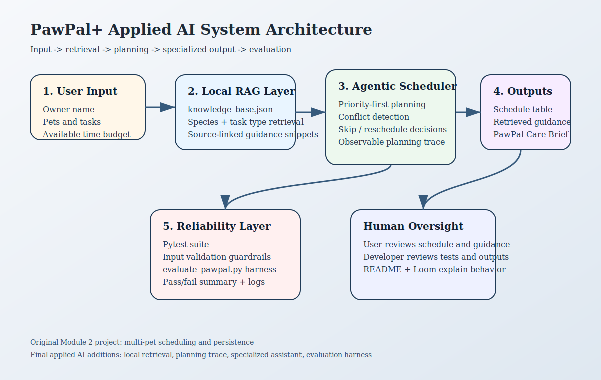

# Demo video link : https://drive.google.com/file/d/16JWZ6CizGqOUBfheEnr9i6tY5UnR4hPP/view?usp=sharing

# PawPal+ Applied AI System

PawPal+ is an AI-integrated pet care planner built from my Module 2 project. The original version focused on multi-pet scheduling, recurring tasks, JSON persistence, and priority-based daily planning. This final version extends that prototype into an applied AI system with local retrieval-augmented guidance, observable agentic planning steps, a specialized pet-care briefing layer, and a repeatable evaluation harness.

## Why This Project Matters

Pet care planning is full of small decisions that become risky when routines are inconsistent. PawPal+ helps an owner organize multiple pets, see what fits inside the day, understand why tasks were scheduled or skipped, and retrieve relevant care guidance before producing its explanation.

## Required AI Features Implemented

### 1. Retrieval-Augmented Generation

PawPal+ retrieves pet-care guidance from a local knowledge base in `knowledge_base.json`. The scheduler matches tasks by species, inferred task type, and keyword overlap, then uses the retrieved snippets inside the generated schedule explanation and the Streamlit UI.

### 2. Agentic Workflow

The scheduling pipeline now records observable intermediate planning steps. Each task is evaluated against date, priority, duration, and remaining time budget. The app shows a planning trace so the user can see each schedule or skip decision.

### 3. Fine-Tuned or Specialized Behavior

Instead of generic schedule text only, PawPal+ now produces a constrained `PawPal Care Brief`. This specialized output uses pet-care tone, fixed sections, and health-related caution language for medication or vet tasks. A baseline summary is also available in code so the specialized output can be compared against a generic version.

### 4. Reliability and Testing System

The project includes automated tests, validation guardrails, and an evaluation script. Tests verify scheduling behavior, retrieval behavior, specialization behavior, and core input validation. The evaluation harness runs predefined scenarios and prints a pass/fail summary.

## Optional Stretch Features Completed

- **RAG enhancement:** the retrieval layer uses custom local documents with source metadata instead of static hardcoded tips.
- **Agentic workflow enhancement:** the system exposes intermediate planning decisions in a structured trace.
- **Specialization enhancement:** the project compares a baseline summary with a constrained, domain-specific pet-care briefing.
- **Evaluation script enhancement:** `evaluate_pawpal.py` runs predefined scenarios and prints a scored summary.

## Architecture Overview

The system has five main pieces:

1. The Streamlit UI collects owner, pet, and task inputs.
2. The scheduler sorts, filters, detects conflicts, and plans a day within the available time budget.
3. The local knowledge base retrieves pet-care guidance before schedule explanations are generated.
4. The specialized assistant formats the final care brief for pet-care planning.
5. The evaluation layer verifies reliability with tests and scenario-based checks.

System diagram:



Demo screenshot:


## Setup

```bash
python -m venv .venv
.venv\Scripts\activate
pip install -r requirements.txt
```

## How To Run

Run the Streamlit app:

```bash
python -m streamlit run app.py
```

Run the CLI demo:

```bash
python main.py
```

Run the automated tests:

```bash
python -m pytest
```

Run the evaluation harness:

```bash
python evaluate_pawpal.py
```

## Sample Interactions

### Example 1: Schedule generation with retrieval

Input:

- Owner available minutes: `90`
- Tasks: `Medication`, `Morning walk`, `Breakfast`, `Play time`

Output behavior:

- The system schedules the tasks in priority-first order.
- It flags the exact-time conflict between `Medication` and `Morning walk`.
- It retrieves medication guidance from the Cornell Feline Health Center and exercise guidance from ASPCA before generating the explanation.

### Example 2: Agentic skip decision

Input:

- Owner available minutes: `45`
- Tasks: high-priority `Medication` for `20` minutes and low-priority `Walk` for `30` minutes

Output behavior:

- The planner schedules `Medication`.
- It skips `Walk` because the time budget is exhausted.
- The planning trace records the intermediate decision and suggested follow-up slot.

### Example 3: Reliability evaluation

Command:

```bash
python evaluate_pawpal.py
```

Observed summary:

```text
PASS | priority_planning
PASS | rag_guidance
PASS | specialized_summary
PASS | time_budget_guardrail
Overall: 4/4 checks passed
```

## Design Decisions and Tradeoffs

- I used a local JSON knowledge base instead of an external vector database because the project needed to stay reproducible and easy to grade.
- The system uses retrieval and structured planning rather than a live hosted LLM, which keeps behavior stable and testable.
- Conflict detection still checks exact matching start times only. It does not yet model overlapping durations such as `08:00-08:30` and `08:15-08:45`.
- The specialized assistant is rule-based and constrained instead of truly fine-tuned. That tradeoff made the project more practical while still demonstrating specialized behavior.

## Testing Summary

- `19/19` automated tests pass.
- The evaluation harness reports `4/4` scenario checks passed.
- Guardrails reject invalid task priorities and non-positive durations.
- A local pytest cache warning appears in this environment because of directory permissions, but test execution still succeeds.

## Reflection

This project taught me that an applied AI system becomes more convincing when retrieval, decision traceability, and evaluation all work together. The biggest improvement over the original module project was not just adding smarter features, but making the system explainable and testable enough that another person can trust what it is doing.

## Files

- `app.py` - Streamlit UI
- `pawpal_system.py` - core models, retrieval, planning, specialized assistant, and guardrails
- `knowledge_base.json` - local RAG source data
- `evaluate_pawpal.py` - scenario-based evaluation harness
- `tests/test_pawpal.py` - automated test suite
- `model_card.md` - reflection, limitations, and ethics notes
- `assets/system_architecture.svg` - system diagram
- `assets/demo_screenshot.png` - app screenshot

## Submission Notes

- Add your final Loom walkthrough link here before submission.
- Keep the repo public and include the final pushed commit history.
