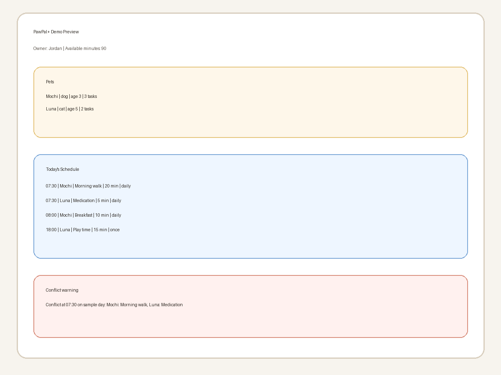

# PawPal+ (Module 2 Project)

PawPal+ is a Streamlit app for planning pet care across multiple pets. It lets an owner add pets, assign care tasks, mark tasks complete, and generate a daily schedule that fits inside the time they have available.

## Features

- Add and manage multiple pets in one owner profile
- Add tasks with a date, time, duration, frequency, and completion status
- Sort tasks by time so the schedule is easy to follow
- Filter tasks by pet name or completion status
- Detect exact-time conflicts and show warning messages
- Automatically create the next daily or weekly task when a recurring task is completed
- Generate a daily plan that fits inside the owner's available minutes
- Show a readable explanation of scheduled tasks, skipped tasks, and conflicts

## Smarter Scheduling

The scheduler has four main algorithmic features:

- `sort_by_time()` returns tasks in chronological order by date and time
- `filter_tasks()` narrows the task list by pet name or completion status
- `mark_task_complete()` handles recurrence by creating the next daily or weekly task
- `detect_conflicts()` returns warnings when two tasks happen at the exact same time

The daily plan is built by taking the tasks for one day, sorting them by time, and adding them until the available time is used up.

## Demo

Run the CLI demo script:

```bash
python main.py
```

Run the Streamlit app:

```bash
streamlit run app.py
```

Demo preview:



## Testing PawPal+

Run the test suite with:

```bash
python -m pytest
```

The tests cover:

- task completion status changes
- task addition to a pet
- chronological sorting
- filtering by pet
- recurring daily task creation
- conflict detection
- schedule generation with skipped tasks when time runs out

Confidence Level: 4/5 stars. The core logic is tested and working, but I would still test more edge cases like overlapping durations and editing tasks in the UI.

## Project Files

- `pawpal_system.py` - backend classes and scheduling logic
- `main.py` - CLI demo script
- `app.py` - Streamlit UI
- `tests/test_pawpal.py` - automated tests
- `uml.md` - Mermaid UML diagram
- `uml_final.png` - exported UML image
- `reflection.md` - project reflection

## Setup

```bash
python -m venv .venv
source .venv/bin/activate  # Windows: .venv\Scripts\activate
pip install -r requirements.txt
```
