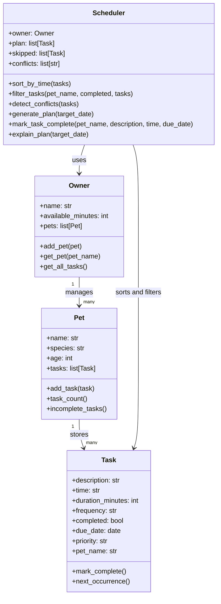

# PawPal+ UML Class Diagram

## Relationships

- One `Owner` can manage many pets.
- Each `Pet` stores its own list of tasks.
- `Scheduler` works across all pets by reading tasks from the owner.
- `Task` supports recurrence through `next_occurrence()`.

## Final Diagram Asset

The exported diagram image for the project is saved as `uml_final.png`.
